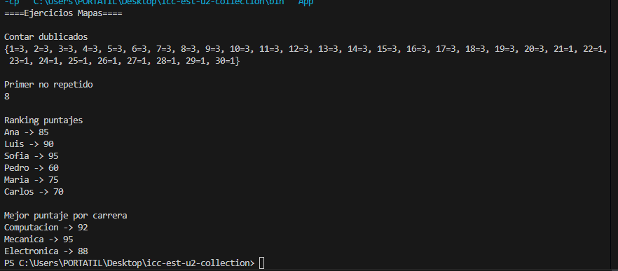

# Práctica: Estructuras No Lineales - 

## Autor
- Nombre: [Edison Jahir Mendieta Armijos]
- Carrera/Curso: [ESTRUCTURA DE DATOS GRUPO - 1 - COMPUTACIÓN]

##  Nombre de la práctica - Fecha
- Práctica: [PC: Maps Ejercicisios]
- Fecha: [2026-01-19]

## Descripción
-Usamos mapas para contar los elementos que se repetian teniendo aprovechando que las llaves no se ingresan de nuevo sino que se sobre escriben los values.
usamos la misma logica para encontrar el primer numero no repetido aprovechando que se ordena por orden de llegada.

## Evidencias
### Captura 1
Inserta aquí la captura del código o de la ejecución.

